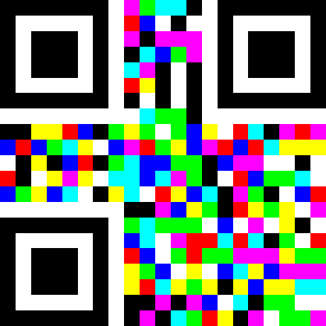

# Prism
```
Do you have a prism to take a closer look?
```
Image:


You can see is a QR code but filled with some rainbow colors

After some inspection of colors, all the colors in the QR code is in full color

Example:
```
Full red in RGB value is (255,0,0)
Full green in RGB value is (0,255,0)
Full blue in RGB value is (0,0,255)
Full purple in RGB value is (255,0,255)
etc...
```
At first I think one of the color channel when its **0** then means that block should be **black**

After some investigation, I found each block is 22 X 22 pixels

So I wrote a [python script](solve.py) to get the RGB values of each block,

and then save the block to new image when the color channel is 0:

```python
for i in range(21):
	for j in range(21):
		r, g, b = rgb_im.getpixel((i*22,j*22))
		if r == 0:
			new_image[0].paste(black,(i*22,j*22))
		if g == 0:
			new_image[1].paste(black,(i*22,j*22))
		if b == 0:
			new_image[2].paste(black,(i*22,j*22))
new_image[0].save("red.png")
new_image[1].save("green.png")
new_image[2].save("blue.png")
```
After running the script, use `zbarimg` to get the flag:
```
# zbarimg red.png 
QR-Code:InnoCTF{N9GntE
```
But is part of the flag only

Therefore, I get QR for the `green.png` and `blue.png`:
```
# zbarimg green.png blue.png 
QR-Code:Pyy5mNT3VvjbpC
QR-Code:HrtIC4lyls3DL}
```
Then I realized its use all color channel (RGB) and combine them

# Flag
> InnoCTF{N9GntEPyy5mNT3VvjbpCHrtIC4lyls3DL}